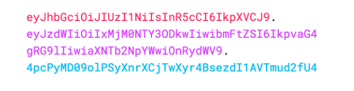



## 前言

JWT（[JSON Web Token](https://jwt.io/)）是基于JSON实现Token的方式。JWT是基于开放标准（RFC 7519）实现的**紧凑**且**自包含**的，用于在各方以JSON形式传输的信息。该信息可以被信任与验证，因为它也是一种数字签名。JWT可以使用HMAC算法或RSA、ESDSA的公钥\私钥进行签名。JWT常常被应用于以下两个场景：

- 授权：这是JWT最常用的场景，用户登陆后可获取JWT，并在后续的每个请求携带他，这将允许用户访问该令牌允许的路由、服务、资源。JWT被广泛应用于单点登录中，具有开销小、轻松跨域使用的特点。
- 信息交换：JSON网络令牌是各方安全传输信息的好方法，使用公私钥对的方法加密时，可以保证持有密钥的人才可以解码数据（参考[SSL/TLS加密传输协议](../ssl-tls)）。此外，由于签名是使用标头和有效负载计算的，你还可以验证内容没有被篡改。

## JWT结构

在其紧凑的形式中，JSON Web令牌由由点（`.`）分隔的三部分组成，它们是：

- 表头
- 有效载荷
- 签名

因此，JWT通常如下所示。

`xxxxx.yyyyy.zzzzz`

让我们分解不同的部分。

### 表头

标头通常由两部分组成：令牌的类型，即JWT，以及正在使用的签名算法，如HMAC SHA256或RSA。

例如：

```json
{
  "alg": "HS256",
  "typ": "JWT"
}
```

然后，这个JSON被Base64Url编码以形成JWT的第一部分。

### 有效载荷

令牌的第二部分是有效负载，其中包含声明。声明是关于实体（通常是用户）和附加数据的声明。声明有三种类型：注册声明、公共声明和私有声明。一般只会添加用户不敏感信息，如ID，名字和权限等，如下所示：

```json
{
  "sub": "1234567890",
  "name": "John Doe",
  "admin": true
}
```

对有效载荷进行Base64Url编码可形成JSON Web Token的第二部分。

>请注意，对于签名令牌，此信息虽然受到防篡改保护，但任何人都可以读取。除非加密，否则不要将机密信息放入JWT的有效载荷或表头元素中。

### 签名

要创建签名部分，您必须获取编码的表头、编码的有效载荷、密钥、表头中指定的算法，并对其进行签名。

例如，如果您想使用HMAC SHA256算法，签名将通过以下方式创建：

```
HMACSHA256(
  base64UrlEncode(header) + "." +
  base64UrlEncode(payload),
  secret)
```

其中，密钥secret存储在服务器，不在网络进行传播。签名用于验证消息在此过程中没有更改，并且在使用私钥签名的令牌的情况下，它还可以验证JWT的发送者是否是它所说的发送者。

对签名进行Base64Url编码可形成JSON Web Token的第三部分。

最后将表头、有效载荷和签名三者以点连接在一起，构成JSON Web Token



## 如何使用

用户端在登录成功后，服务器会根据用户信息生成JWT令牌，并返回给客户端。之后用户向后端请求接口时，一般在请求头携带token，后端接收请求后，在拦截器中解析token，确认用户登录状态和判断权限。

```
Authorization: Bearer <token>
```

## JWT与SSL/TLS

JWT与[SSL/TLS加密传输协议](../ssl-tls)中的数字签名类似，具有不可篡改但容易获取的特点，细节与作用却有所不同。区别与联系如下：

- JWT用户信息与TLS数字证书公钥是透明的，但TLS中的预主密钥是不可见，由公钥加密的。原因在于在授权场景中，用户信息只包含用户名、用户ID等不敏感信息，使用Base64编码，即使黑客获取了也无济于事；而TLS的预主密钥用于保障数据的安全传输，是隐私数据。
- JWT与TLS数字证书都采用自校验的方式来防止内容被篡改，从而保证JWT是由Server端发布，TLS数字证书是由CA机构发布的，都具有真实性。
- JWT用于标识用户的登录状态与授权状态，Server端一旦发布了便无法对其管控，直至过期，这也说明了任何人获取后都可依靠其获得权限，存在一定的风险；数字证书由CA机构统一颁布，其有效性得到有效的管控，若签名通过后只能说明公钥没有被篡改，不标识任何状态。

## 参考

https://jwt.io/introduction
