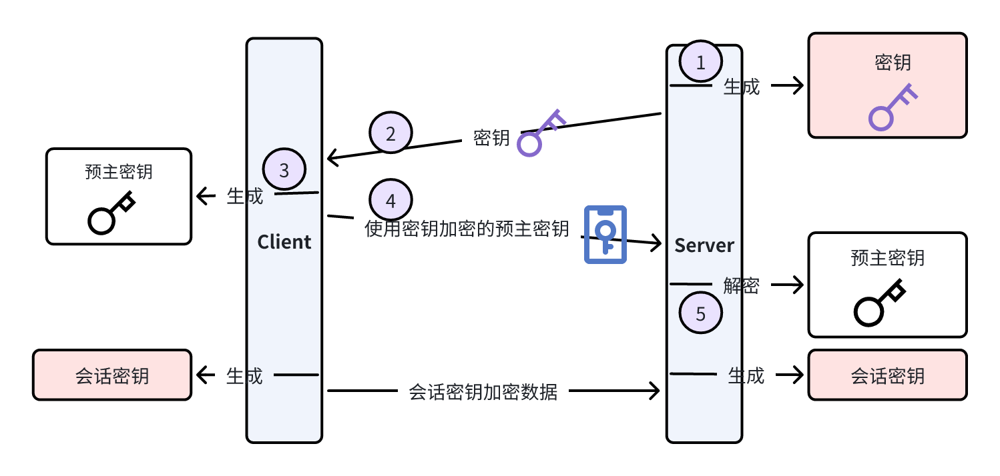
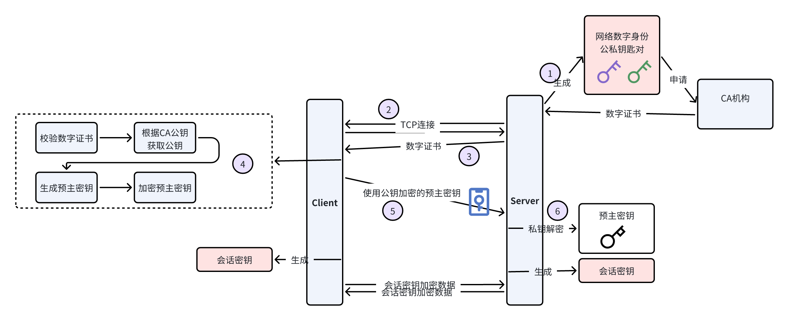



## 前言

HTTP（超文本传输协议）作为一种应用层协议，现已广泛应用于计算机进程之间的通信。然而，由于其在网络中以明文形式传输数据，对于安全性要求高的信息，如军事机密、交易数据、用户密码等，存在严重的隐私和安全风险。在这种背景下，HTTPS协议应运而生，HTTPS在HTTP基础上引入了SSL/TLS加密协议，通过**密钥对传输数据进行加密**，并结合数字签名技术确保访问站点的真实性和合法性。即便黑客等不法分子接获数据，也无法在短时间内解密，从而极大地提升了数据的安全性。

接下来，我们将深入剖析HTTPS中的SSL\(TLS协议、数字证书等核心概念，探讨其发展背景、技术改进历程及实际应用效果，逐步引导大家全面理解“加密”背后的技术原理和过程。（注：SSL\TLS协议的真实流程与本文可能略有出入，但大致相同）

## SSL/TLS

### 原理及流程

Secure Socket Layer译为安全套接层（下面简称SSL），是在TCP/IP上实现的公开密钥安全协议，由Netscape公司率先采用。大致分为三个版本，第一个版本由于其存在严重的安全漏洞，从未公开发布，其余的版本2.0，3.0也因为存在诸多安全隐患，已在2000年被淘汰。之后IETF（互联网工程任务组）标准化SSL后提出了Transport Layer Security（传输层安全，下面简称TLS），彻底将SSL取代。TLS提供了更为安全和标准化的加密通讯方式，它修复了SSL的安全问题，并提供向后兼容性，TLS与SSL的主要区别在于它们的安全特性和标准支持，随着TLS的版本迭代，每一代TLS协议都在强化安全措施去除已知漏洞，并支持更先进的加密算法和技术。TLS的迭代过程这里不再赘述，本文关注的是更为通用的算法设计思想及细节。

鉴于部分读者没有学过密码学相关课程，也不清楚加密算法的流程，下面对加密/解密过程下一个不严谨（但正确）的定义

> 加密的本质就是使用密钥1，通过加密算法对数据进行加密；而解密使用密钥2，通过解密算法进行解密

抛开算法实现细节不谈，客户端与服务端在正式通信之前，理论上只要告诉对方支持何种加密算法和密钥（下面称**会话密钥**）就可以了。加密算法的种类不多，并且是通用的，全世界都知道；而会话密钥理论上只能服务端和客户端持有，这样才能保证经过会话密钥加密的数据能准确加\解密，并且具有安全性（黑客窃取后无法加\解密）。那么，如何保证服务端和客户端持有相同的会话密钥呢？有个简单的方法是客户端或服务端生成会话密钥，再通过网络发送给对方。由于会话密钥很长，传输会浪费网络资源，所以客户端与服务端一般交换一个随机数，再使用密钥派生函数（如HMAC）生成最终的会话密钥，其中随机数被称为**预主密钥**，流程如下图所示

聪明的读者肯定发现了问题，如果这个预主密钥（2）在中途被窃取了怎么办。简单，加密不久好了，加密之后黑客就无法破解了。TLS也确实是这样做的：服务器生成一个密钥（1），将其发送给客户端（2），客户端使用这个密钥加密预主密钥得到加密结果（3、4），服务端再使用这个密钥解密加密结果，从而得到预主密钥（5），这个过程被成为**对称加密**，如下图所示

> 这里涉及了一个新名词：对称加密，即使用相同的密钥对同一个数据进行加密解密。

如果按照上述流程对预主密钥进行加密，中间产生的密钥再被窃取了怎么办，再如法炮制这种对称加密的过程又会继续产生一个中间的密钥，套娃无法解决我们的问题。于是，引入**非对称加密**：服务器生成一个公私钥对（即公钥和密钥）（1），将公钥发送给客户端（2），客户端使用公钥加密预主密钥得到加密结果（3、4），服务端再使用私钥解密加密结果（5），从而得到预主密钥。非对称加密相对于对称加密，增加了公钥私钥两个概念，这保证了持有其中一个密钥（如公钥）只能解密另一个密钥（私钥）加密的数据，同样地，持有密钥只能解密公钥加密的数据，这个过程相对于非对称加密更安全。由于公钥在网络中传输，而私钥留在服务器，这意味着即使黑客截取了公钥，仍然无法通过公钥对加密的预主密钥进行解密，而私钥才可以。非对称加密流程如下：

> TLS协议中选择在网络中传输公钥的原因是：公钥长度短，能减少传输资源消耗

以上的过程看似天衣无缝，但却在公钥传输过程中出现了纰漏，黑客获取公钥无效，但可以篡改并伪装网络请求，截获服务器发送的公钥（2），并将其替换成“其他公钥”（如黑客生成的公私钥对），并再次截获客户端通过公钥加密的预主密钥（4），对其进行解密，从而得到预主密钥。


ps：黑客同样可以截获公钥（2）和用公钥加密的预主密钥（4），并将**加密后的预主密钥**替换为**加密后的“黑客预主密钥”**。当服务器成功解密后，将使用“黑客的预主密钥”生成会话密钥，此时客户端依然使用自己的预主密钥生成会话密钥。由于两个会话密钥不同，首次数据交换时便无法正确解密数据，从而导致会话终止。


综上，无论使用对称加密还是非对称加密，我们都不能保证传输预主公钥的绝对安全性。一方面，对称加密保证了公钥（密钥）在传输过程中的不可篡改性，但其可查看性导致了预主密钥的轻松破解；另一方面，非对称加密保证了公钥（密钥）在传输过程中的“不可见性”（这里并非真正的不可见，而是就算获取到了公钥，没有私钥仍然无法破解预主密钥），但其可篡改性导致了预主密钥的轻松破解。下面我们介绍一种方式，即数字证书来保证非对称加密下的绝对安全性。

### 数字证书

数字证书是网站持有人员向CA机构（Certificate Authority，即证书授权中心）申请的证书，包含个人或者组织网络数字身份（如区域信息、邮箱、域名等）和公开密钥等信息。具体过程如下：CA机构使用**CA私钥**对服务器的公钥进行加密，然后计算网络数字身份与加密后的公钥的哈希值，并将两者合并生成证书指纹。最后，将网络数字身份、加密后的公钥信息和证书指纹合并生成数字证书，并将其发送给网站。



CA机构是‌数字证书发行的唯一机构，负责为电子商务交易中的用户发放数字证书，确保公钥的合法性和安全性。CA机构，也称为证书授权中心（Certificate Authority），是电子商务交易中受信任的第三方，承担公钥体系中公钥的合法性检验的责任。CA机构为每个使用公开密钥的用户发放一个数字证书，这些证书通过CA机构的‌数字签名，确保了攻击者无法伪造和篡改证书。‌



那么如何使用数字证书呢？在建立TLS连接后（具体将在完整流程中说明），服务器给客户端发送数字证书。客户端首先通过hash算法进行**证书签名**，以确保其完整性（如分别计算**CA私钥加密的公钥**、证书内容的hash值，将其合并与证书指纹进行对比），接着便可通过操作系统自带的CA公钥解密得到公钥。

> ps：证书签名是使用算法校验hash值的行为，不是名词！！！

数字证书在非对称加密算法上嵌套了一层，保证其仍具有不可见性，那么它是如何保证公钥传输的不可篡改性的呢？假设数字证书被黑客截取并篡改，我们讨论以下三个场景：

- 若改变数字证书的某一部分内容，证书签名即计算hash值并与证书指纹对比不通过，程序终止
- 若改变数字证书的内容，使得其通过数字签名，这是不可能的，比如使用原证书的信息，使用
- 若将数字证书替换成其他网站向CA机构申请的数字证书，证书签名通过，但证书信息如域名与所请求的服务器不一致，程序终止

综上，数字证书使用自校验的方式保证了公钥的不可篡改性，进而保证了其在公钥传输场景下的唯一性，最终实现了绝对安全性。

### 完整流程

在论述TLS协议的完整流程前，先来简单回顾TCP的工作流程，TCP是一种提供了面向连接的、可靠字节流服务，并拥有流量控制、拥塞控制等功能的协议。在TLS协议执行之前，客户端与服务端之间会发生什么事情呢？答案是**在传输层中建立连接**，也就是我们通常说的三次握手过程：首先，客户端发送建立连接请求给服务端，包含\\(\rm{SYN}_1=\rm{ISN}\_{client}\\)（即同步字段）；服务端接收请求后，会构建请求回复客户端，其中\\(\rm{SYN}_2=\rm{ISN}\_{server}\\)，\\(\rm{ACK}_2=\rm{SYN}_1+1\\)（即确认字段，确认收到的是刚才的请求）；最后，客户端接收到服务端的请求，再次构建请求回复服务端，其中\\(\rm{SYN}_3=\rm{SYN}_1+1\\)，\\(\rm{ACK}_3=\rm{SYN}_2+1\\)，这便完成了三次握手。由于TCP不是本文的论述重点，关于协议内容，涉及的算法原理、四次挥手等不再赘述，感兴趣的读者可自行了解。

因此，TLS协议完整流程如下：服务端预先准备好公钥和网络数字身份，并成功向CA机构申请数字证书（1）。TCP通过三次握手建立连接（2），接着TLS进行两次握手：首先，客户端向服务端发送一个client hello消息，并传输相应的TLS版本和支持的加密算法；服务端收到回应后发送一个server hello消息，传输将要采用的TLS版本并选择最佳加密算法，此时握手完成。服务端向客户端发送由CA机构颁布的数字证书（3）。客户端接收数字证书后，首先通过hash算法验证证书签名，以确保其完整性（如分别计算CA私钥加密的公钥、证书内容的hash值，将其合并与证书指纹进行对比），接着通过操作系统自带的CA公钥解密得到公钥，确保其真实性。进一步地，客户端生成预主密钥，通过公钥加密预主密钥（4），并将其发送给服务端（5）。服务端接收后用私钥解密（6），最终实现仅双方可见的预主密钥场景，如下图所示：

> 注：数字证书保证了公钥的不可篡改性，但没有保证其不可见性，原因在于：虽然公钥经过CA私钥加密，但大部分操作系统上都含有解密的CA公钥，对于黑客来说，公钥仍然是可见的。再根据原理及流程中论述的非对称加密过程，我们知道仅仅可见公钥对于破解预主密钥没有帮助，所以数字证书可以保证公钥传输的绝对安全性

## 参考

https://blog.csdn.net/liweiny/article/details/137564206

https://www.bilibili.com/video/BV1h1421y7YH/?vd_source=49a9f7cbff0f0e8494f93d68e40df4fd

https://info.support.huawei.com/info-finder/encyclopedia/zh/SSL.html