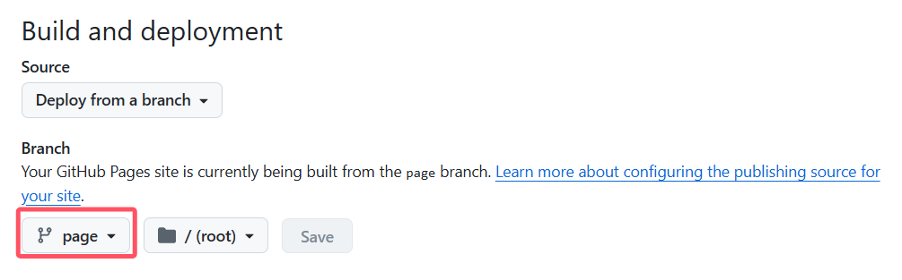
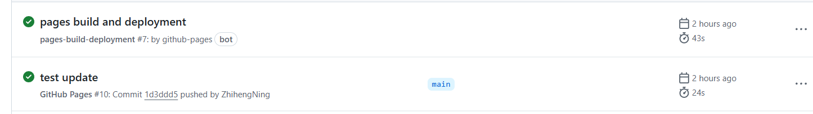
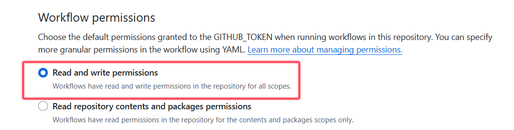

## 前言

此前我并没有搭建个人网站的经验。搭建博客的原因，请参考[搭建博客初衷](../../myself/blog_reason/)。本文旨在记录从调研、安装到网站搭建完成的整个过程，同时分享一些过程中遇到的坑点。网站基于[hugo](https://gohugo.io/)框架，使用[Blowfish](https://themes.gohugo.io/themes/blowfish)主题模板搭建，并通过[GitHub Pages](https://pages.github.com/)进行托管。

## Hugo简介

[hugo](https://gohugo.io/) 是一款开源的静态网站生成器，以其惊人的速度和高度的灵活性著称，特别适合用于构建个人博客。相比传统的前端三件套（HTML、CSS、JavaScript）或像 Vue 和 React 这样的前端框架，Hugo 提供的脚手架工具能够帮助用户快速构建丰富多样、视觉精美的网站。即使不具备前端开发经验，用户只需编辑配置文件并编写 Markdown 文件即可轻松创建内容。

```
my-site/
├── archetypes/
│   └── default.md
├── assets/
├── content/
├── data/
├── i18n/
├── layouts/
├── static/
├── themes/
└── hugo.toml   
```

### 模板

hugo主题商店提供了多种多样的模板，大家可以根据喜好选择模板下载并使用，本网站使用的模板为[Blowfish](https://themes.gohugo.io/themes/blowfish)

## 快速开始

关于如何安装与使用blowfish模板，作者已经给出了详细的[中文文档](https://blowfish.page/zh-cn/docs/)，具体流程本文不再赘述，下面列举关键内容

### 安装Hugo

在使用blowfish前，需确保本机已正确安装hugo，安装教程见[安装与配置](https://gohugo.io/installation/)

### 使用Blowfish构建网站

Blowfish提供了工具Blowfish-Tools，用于创建一个新的 Hugo 项目、安装 Blowfish 主题并设置配置文件



截止到2024.11.10，该脚手架仍存在一定的bug，因此不建议使用



[文档](https://gohugo.io/installation/)提供三种方式安装Blowfish模板，包括Git子模块安装，Hugo模块安装、手动文件复制。其中Git子模块链接到的是[Github源码](https://github.com/nunocoracao/blowfish)，并非放在[releases](https://github.com/nunocoracao/blowfish/releases)中稳定的版本，可能出现bug，**不建议使用**，~~笔者曾经被此硬控一下午~~；Hugo使用GO来初始化，使用前需确保安装GO，略显麻烦，**不建议使用**；手动文件复制，即在[releases](https://github.com/nunocoracao/blowfish/releases)中下载latest版本，然后将其复制到`themes`目录下，**建议使用**。

### 配置

按照[文档教程](https://blowfish.page/zh-cn/docs/installation/)，你的 `config` 目录看起来应该是这样：

```
config/_default/
├─ hugo.toml
├─ languages.en.toml
├─ markup.toml
├─ menus.en.toml
├─ module.toml  # 通过 Hugo 模块安装
└─ params.toml
```

`en`代表主语言为英文，若想修改为中文，需在`hugo.toml`文件中配置`defaultContentLanguage = "zh-cn"`,`hasCJKLanguage = true`，并将`languages.en.toml`与`menus.en.toml`依次替换成`languages.zh-cn.toml`、`menus.zh-cn.toml`，对应的语言文件见[https://github.com/nunocoracao/blowfish/tree/main/exampleSite/config/_default](https://github.com/nunocoracao/blowfish/tree/main/exampleSite/config/_default)。

若选择**手动复制文件**方式构建网站，`config`目录应为：

```
config/_default/
├─ hugo.toml
├─ languages.zh-cn.toml
├─ markup.toml
├─ menus.zh-cn.toml
└─ params.toml
```

在完成基本配置后，需着重关注`hugo.toml`文件，根据不同的Github部署方式，`baseURL`有如下两种配置方式

- 使用[Github部署方式一](#方式一)，需修改为`https://{username}.github.io/`，比如`baseURL = "https://zhihengning.github.io/"`
- 使用[Github部署方式二](#方式二)，需修改为`https://{username}.github.io/{repository name}/`，比如`baseURL = "https://zhihengning.github.io/blog/"`

其余的配置参数，可参考[入门指南](https://blowfish.page/zh-cn/docs/getting-started/)与[详细配置](https://blowfish.page/zh-cn/docs/configuration/)

### 本地运行

在根目录下运行`hugo serve`命令，出现下面内容即为启动成功

```shell
Built in 205 ms
Environment: "development"
Serving pages from disk
Running in Fast Render Mode. For full rebuilds on change: hugo server --disableFastRender
Web Server is available at http://localhost:56518/blog/ (bind address 127.0.0.1)
Press Ctrl+C to stop
```

### Github部署

#### 方式一

按照[本地运行](#本地运行)启动项目后，在根目录查看生成的`public`文件夹，里面包括由hugo框架生成的html文件及图片资源，将其发布到Github上即可，具体流程如下：

- 在Github上创建仓库`github.{username}.io`，其中`username`为你的用户名，例如`github.ZhihengNing.io`
- 在`public`目录下初始化git仓库，并将其推送到远程仓库`github.{username}.io`
- 浏览器输入https://github.{username}.io/访问网站

以上流程看起来简单，但仍有诸多不便。例如：每次push到远程仓库，需要在本地运行一遍生成public目录；Github page部署与本地运行两种方式存在本质差别，Blowfish部分的功能无法正常显示。

#### 方式二

在main分支下使用Github Actions自动构建项目，创建新的分支存储构建资源（public文件夹），最后使用Github pages自动部署页面。具体流程如下：

- 在Github上创建仓库，如`blog`

- 在根目录下初始化git仓库

  可能需要通过`.gitignore`文件排除`public`文件夹

- 创建存储**构建资源分支**，如`page`
- 按照文档给出的Github page的[部署教程](https://blowfish.page/zh-cn/docs/hosting-deployment/#github-pages)，在`.github/workflows`中创建`gh-pages.yml`，并修改`publish_branch`为上一步的构建资源分支，内容如下：

```yml
# .github/workflows/gh-pages.yml

name: GitHub Pages

on:
  push:
    branches:
      - main

jobs:
  build-deploy:
    runs-on: ubuntu-20.04
    concurrency:
      group: ${{ github.workflow }}-${{ github.ref }}
    steps:
      - name: Checkout
        uses: actions/checkout@v3
        with:
          submodules: true
          fetch-depth: 0

      - name: Setup Hugo
        uses: peaceiris/actions-hugo@v2
        with:
          hugo-version: "latest"

      - name: Build
        run: hugo --minify

      - name: Deploy
        uses: peaceiris/actions-gh-pages@v3
        if: ${{ github.ref == 'refs/heads/main' }}
        with:
          github_token: ${{ secrets.GITHUB_TOKEN }}
          publish_branch: page
          publish_dir: ./public
```

- 访问 Github 代码库的 **Settings > Pages** 部分，它应该被设置为构建资源分支

  

- 将本地文件push到远程仓库的main分支下，此时Github会依次启动两个任务流`Github Pages`与`pages-build-deployment`，分别用于构建资源并推送到page分支、部署page分支的静态资源

  

- 在浏览器输入https://github.{username}.io/blog 访问网站

## 踩过的坑

### 部署失败

若在部署网页时日志提示403，无写入权限

```shell
  fatal: unable to access 'https://github.com/ZhihengNing/blog.git/': The requested URL returned error: 403
  Error: Action failed with "The process '/usr/bin/git' failed with exit code 128"
```

应配置对应的代码库，按照`Settings -> Action -> General -> Workflow permissions`的顺序打开，勾选`Read and write permissions`



### 公式渲染

Blowfish提供了KaTex的公式渲染组件，使用方式见[数学表达式](https://blowfish.page/zh-cn/samples/mathematical-notation/)。由于大部分人包括笔者编写markdown时使用typora，它仅仅支持MathType的书写方式，即使用`$`或`$$`包裹公式，导致公式无法在网页中渲染。于是笔者提供了python的[脚本文件](https://github.com/ZhihengNing/blog/blob/main/KaTex_transfer.py)，用于将公式转换为KaTex的形式，并提供[bat脚本](https://github.com/ZhihengNing/blog/blob/main/start.bat)，让本地构建运行前先执行python脚本。

